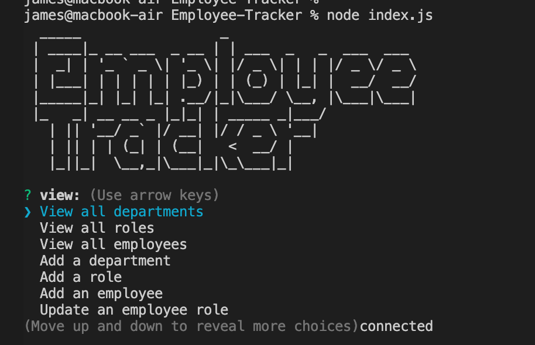

# Employee-Tracke 

- [Description](#description)
- [Installation](#installation)
- [Usage](#usage)
- [Contributions](#contributions)
- [Tests](#tests)
- [Questions](#questions)
- [License?](#license)

## Description

A CLI tool for administrators to organize the company departments, roles, and employees by using a mysql database.

## Installation

Clone the project and run with `node index.js`

## Questions

Send me and email [here](mailto:james91055@gmail.com) to contact me directly.

## License

This project is licensed under the [MIT License](https://choosealicense.com/licenses/mit/) - click the link to read the license.

## Demo

[Video Demo](https://www.loom.com/share/f5a6b0bfe52245719c7133dcb0b9a8e9)

